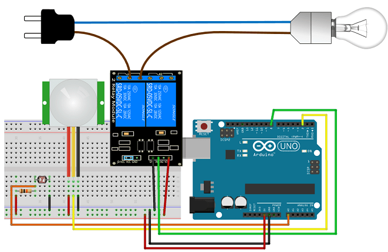

# Lumière de sécurité nocturne avec Arduino

## Auteur
Elkhoulati Yahya

## Aperçu du Projet

Dans ce projet, vous allez construire un éclairage de sécurité nocturne à l'aide d'un module relais, d'une photorésistance et d'un Arduino.
Un éclairage de sécurité nocturne ne s'allume que lorsqu'il fait sombre et qu'un mouvement est détecté.
Voici les principales caractéristiques de ce projet :
- La lampe s'allume lorsqu'il fait sombre ET qu'un mouvement est détecté.
- Lorsqu'un mouvement est détecté, la lampe reste allumée pendant 10 secondes.
- Lorsque la lampe est allumée et détecte un mouvement, elle recommence à compter 10 secondes.
- Lorsqu'il y a de la lumière, la lampe s'éteint, même si un mouvement est détecté.

---

## Composants

- **Arduino Uno**
- **Capteur de mouvement PIR**
- **Photorésistance**
- **Résistance 10 kOhm**
- **Module relais**
- **Jeu de cordons pour lampe**
- **Plaque d'essai**
- **Fils de raccordement**

---

## Schéma de Câblage




### Exemple de Code

```cpp
int relay = 8;
volatile byte relayState = LOW;
int PIRInterrupt = 2;
void setup(){
    pinMode(relay, OUTPUT);
    digitalWrite(relay, HIGH);
    pinMode(PIRInterrupt, INPUT);
}
void loop(){
    if((millis() - lastDebounceTime) > debounceDelay && relayState == HIGH){
    digitalWrite(relay, HIGH); // relay OFF
    relayState = LOW;
    Serial.println("OFF");
  }
  Serial.println("ON");
  lastDebounceTime = millis();
}
```

---

### Structure du Projet

```
📂 Security_Light_Arduino
├── Security_Light_Arduino.md
├── LICENSE
├── Code
│   └── security_light.ino
└── Images     
    └── schema_cablage.png     
        
```

---


**Lien vers le Dépôt GitHub :** [Votre Lien Ici]


